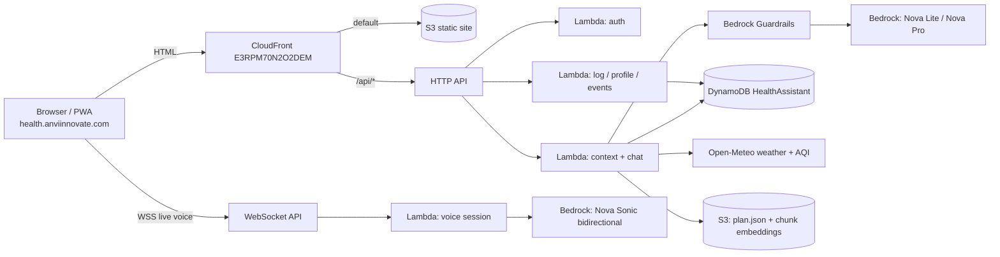

# 02 — Architecture and model selection

## Shape

Static site (existing `anviinnovate-health` stack) stays exactly as is — public,
CloudFront + S3. The assistant is a new, separate backend stack behind the SAME
CloudFront distribution under `/api/*`, so cookies are first-party and there is no
CORS surface. This mirrors the repo's separation principle: shipping assistant code
can never produce a changeset against the static site or the main anviinnovate stack.

## Model selection (the "which Amazon model is best" answer)

| Job | Model | Why this one |
|---|---|---|
| Routine chat, "what now", plan Q&A | **Amazon Nova Lite** | Fast, very cheap, more than sufficient when the context engine has already done the reasoning and the model mostly phrases + converses |
| Weekly review, plan-change reasoning, long multi-turn | **Amazon Nova Pro** | Stronger reasoning for the few calls/week that need it; routed automatically by intent |
| Live speech-to-speech | **Amazon Nova Sonic** | The only Bedrock model with true bidirectional streaming speech-in/speech-out with barge-in; sub-second turn latency; Indian-English capable |
| Hold-to-talk transcription | **Amazon Transcribe (streaming)** | Cheaper than running Sonic for one-shot utterances; en-IN model |
| Spoken replies in hold-to-talk | **Amazon Polly (neural, en-IN "Kajal")** | Pennies per reply; caches repeated phrasings |
| Retrieval embeddings | **Amazon Titan Text Embeddings V2** | 256-dim mode keeps vectors small enough to store in DynamoDB items |
| Safety net | **Amazon Bedrock Guardrails** | Denied topics, contextual grounding check, PII masking — applied to both input and output |

Escalation path noted but not default: Anthropic Claude (Sonnet) on Bedrock as a
drop-in for the Nova Pro tier if weekly-review quality disappoints. Routing is a
config value, not a rewrite.

## Why NOT Bedrock Knowledge Bases (decision record)

Bedrock KB requires a vector store; the managed default (OpenSearch Serverless) has a
minimum OCU footprint that costs more per month than everything else here combined —
it alone would break the near-zero-cost requirement. The corpus is ONE document
(~200 chunks). Instead: chunks + Titan embeddings are precomputed at build time by a
script, stored as a single JSON artifact in S3 (loaded into Lambda memory on cold
start), cosine similarity in-process. Retrieval cost: zero. Rebuild is a script run
whenever the plan HTML changes. Revisit KB only if the corpus grows past ~5 MB text.

## Request flow for one chat turn

1. Client sends: message + context envelope (local time, tz, geoloc opt-in, page section user is viewing, client mode).
2. Auth middleware verifies the session JWT cookie (existing pattern, see 05).
3. **Red-flag scanner** (deterministic, in-process, <1 ms) checks the message against the §15 symptom lexicon → on hit, returns the hard-coded stop-rule response; no model call at all.
4. Context engine builds the state block (see 03) — programme day, today's log, weather/AQI, open medical items.
5. Intent router: schedule-class question → answer drafted by engine, Nova Lite phrases it. Knowledge-class ("why soak almonds?") → top-k chunks retrieved, Nova Lite answers grounded on them. Review-class → Nova Pro.
6. Bedrock Guardrails wraps the call (input + output policies).
7. Post-checker verifies required elements (disclaimer footer when medical-adjacent; deep-link present; no dosage/prescription tokens) → regenerate once on failure, else fall back to template answer.
8. Response streamed to client; suggestion logged; token/cost counters incremented.

## Regions and quotas

Everything in us-east-1 (matches account's existing stacks; all named models
available there). Bedrock model access must be enabled once in the console for:
Nova Lite, Nova Pro, Nova Sonic, Titan Embeddings V2. Service quotas at defaults
are far above single-family usage.
